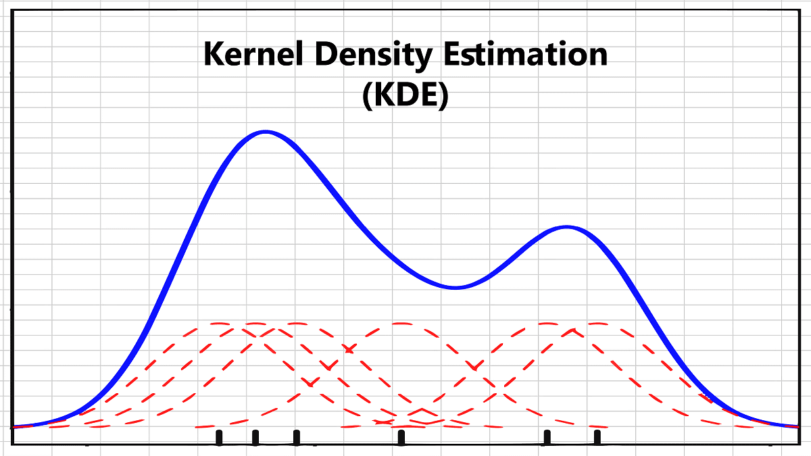
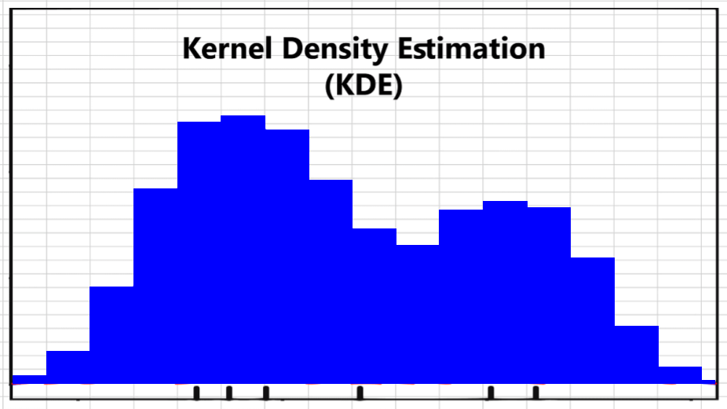

# KDE - method
## Introduction
The concept of this model is based on Kernel Density Estimator. Each sample is mapped to a 3D normalized grid. This grid is then filtered through a process where a 3D kernel is matched to each point and discretized over a fixed number of neighbour cells. For each position in the grid, the values of all the kernels that overlap on it are then added up.

 Continue         		   |  Discrete
:-------------------------:|:-------------------------:
  |  

## Architecture
The architecture of this method is as following:
- data : this folder needs to be created since it is in the _.gitignore_ file. The dataset for the training and grid-search can then be placed into it and will need to be referenced in the corresponding files.
- inference: This folder contains everything linked with inference (dataset, results)
- log: This folder contains all the results of the different trainings and grid-searchs. For each new one, a subfolder is created containing all the results. (logs, confusion matrix, best model, ...)
- src: This folder contains the different files for preprocessing, results visualization, dataset class, etc
- models: This folder contains the model implementation and a subfolder in which a _.tar_ file can be placed to train from existing model or for inference.
- _gridsearch.py_, _train.py_, _inference.py_ are the script to run for the corresponding tasks

## dataset
Each dataset needs to be paced in the root of the folder _./data/_.
The structure of the dataset needs to be as following:
- dataset_name/ 
	- Single/
		- _*.pcd_
	- Multi/
		- _*.pcd_
	- Garbage/
		- _*.pcd_
	- modeltrees_shape_names.txt (name of the classes)

**Important note: The file modeltrees_shape_names.txt needs to be at the root of each dataset. It can be found in _./inference/_**

## Training
In order to train a model, the script _train.py_ needs to be runned. The hyperparameters are all at the beggining of the file.
If the dataset is new, the flag _do_preprocess_ needs to be _True_. It will trigger the creation of the _.csv_ files and the list of classes inside the foler of the dataset. 
If the dataset has not been trained on yet, the flage _do_update_caching_ needs to be _True_. It will trigger the embedding of each _.pcd_ file into a KDE grid saved into a _.pickle_ file.

## Grid-Search
The grid-search is done by running the _gridsearch.py_ script. It will loop into a range of values for the kernel size and number of repetition of the kernel.
All the hyperparameters can be specified at the beggining of the _main()_ and the range of kernel size and number of repetition of the kernel are specified by the variables _lst_kernel_sizes_ and _lst_repeat_kernel_.

## Inference
In order to do inference, the samples to processed needs to be placed in the folder _./inference/data/_.
The inferencec is then done by running the script _inference.py_. It will process each sample with the model saved in _./model/pretrained/model_KDE.tar_.
The samples will be copied in the folder _./inference/results/_ inside the folder corresponding to their respective class and a file _results.csv_ will be created containing the class assignation per sample. 
